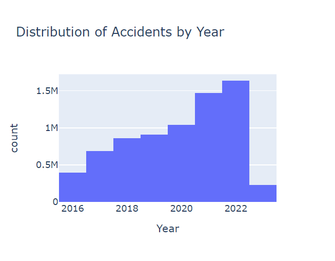
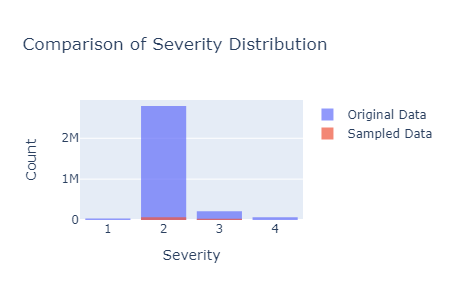
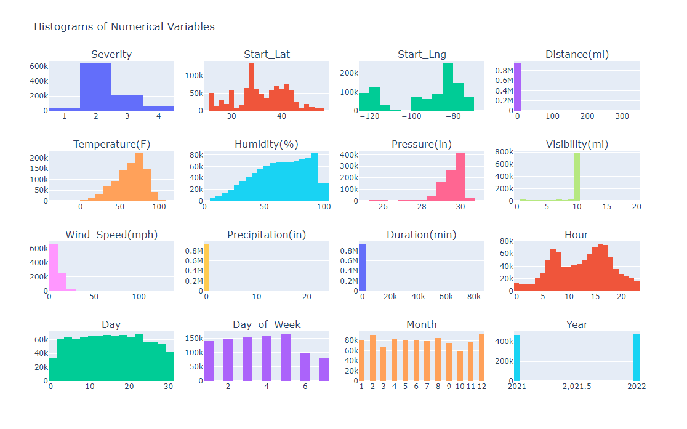
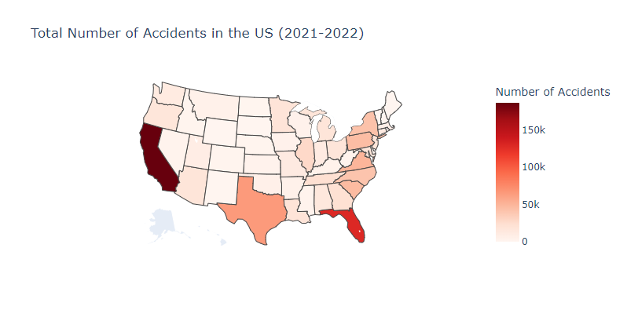
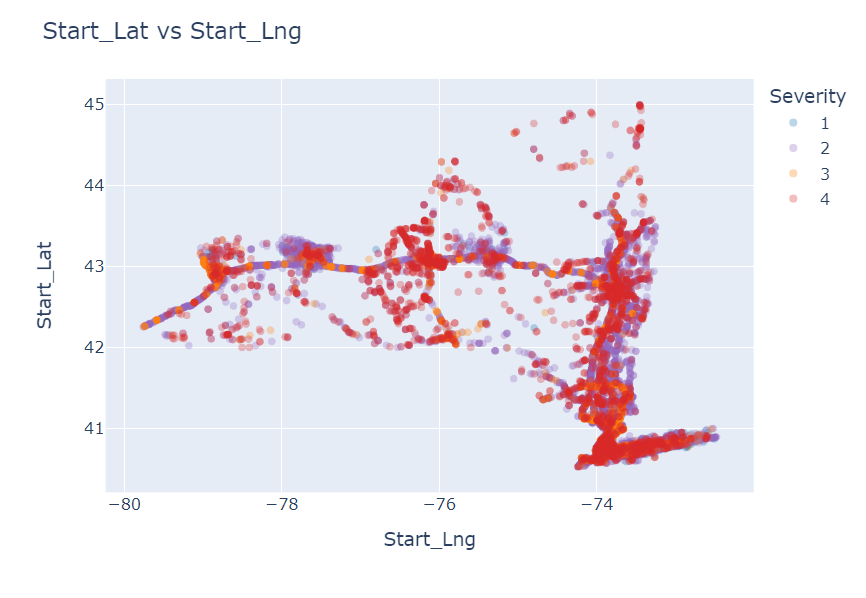
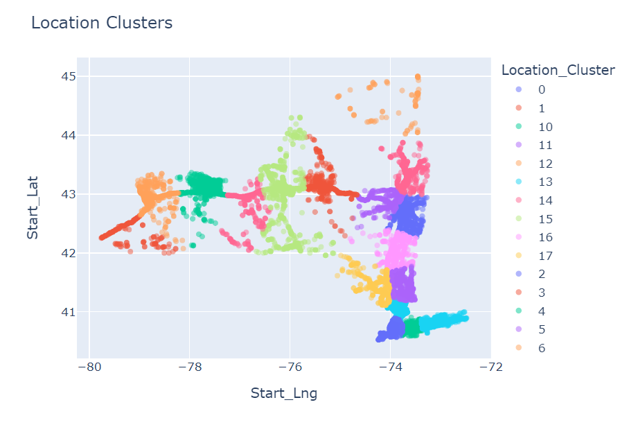
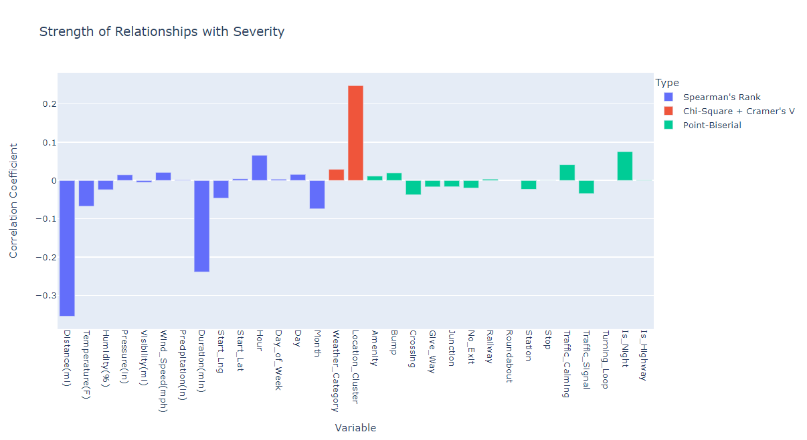
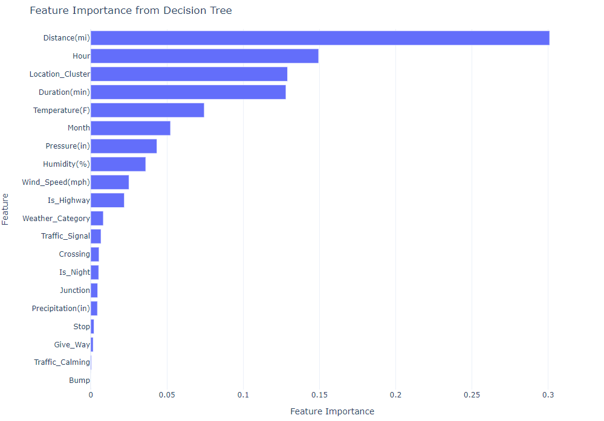

# NY Traffic Accidents Analysis
## 1. Project Overview
With this project we explore data about traffic accidents in the US to uncover the factors associated with different level of severity of an accident. We also build a machine learning model to predict the severity of an accident. Insights from the data could be used to set up effective measures to prevent and/or swiftly respond to traffic accidents.

## 2. ETL Steps: Extract, Transform, Load Process
### 2.1. Data Overview
The US Traffic Accident dataset from [Kaggle](https://www.kaggle.com/datasets/sobhanmoosavi/us-accidents) provides comprehensive information on traffic accidents across the United States from 2016 to 2023. For our analysis, we considered the following key columns:
* `Severity`: Accident severity rating (on a scale from 1 to 4). 1 indicates the least impact on traffic (i.e., short delay as a result of the accident) and 4 indicates a significant impact on traffic (i.e., long delay).
* `Start_Time`: Start time of the accident.
* `End_Time`: Time when the impact of the accident on traffic flow was dismissed.
* `Start_Lat`/`Start_Lng`: Latitude and longitude where the accident started.
* `Distance(mi)`: The length of the road extent affected by the accident.
* `Street`, `City`, `County`, `State`: Location details of the accident.
* `Temperature(F)`, `Humidity(%)`, `Pressure(in)`, `Visibility(mi)`, `Wind_Direction`, `Wind_Speed(mph)`, `Precipitation(in)`, `Weather_Condition`: Various weather-related attributes.
* `Amenity`, `Bump`, `Crossing`, `Give_Way`, `Junction`, `No_Exit`, `Railway`, `Roundabout`, `Station`, `Stop`, `Traffic_Calming`, `Traffic_Signal`, `Turning_Loop`: Boolean indicators for the presence of specific road features.

### 2.2. Data Extraction
We load the US Traffic Accident dataset from Kaggle using Pandas.

### 2.3. Data Transformation
1. Remove Redundant and Irrelevant Variables:
   * Drop columns that do not add value to the predictive modeling process, such as End_Lat, End_Lng, Zipcode, Airport_Code, etc.
2. Fix Data Types:
   * Correct data types for various columns, especially time-related ones like `Start_Time` and `End_Time`.
3. Remove Duplicates:
   * Eliminate duplicate rows to ensure data quality and integrity.
4. Handle Missing Values:
   * Drop rows with missing values if they constitute less than 2% of the dataset, such as `Street` and `City`.
   * For columns with more significant missing values, perform imputation. For example, fill missing values in `Precipitation(in)`.
5. Fix Inconsistencies: Identify and correct unrealistic values in numerical columns
   * Ensure consistency and plausibility for `Temperature(F)`, `Distance(mi)`, `Pressure(in)`, `Visibility(mi)`, and `Wind_Speed(mph)`. For instance, wind speeds of 1087mph.
6. Feature Extraction and Engineering: Extract new features from existing columns or by combining multiple columns
   * Infer whether a road is a highway or local road, based on the street name (`Is_Highway`).
   * Compute `Duration(min)` as the difference between `End_Time` and `Start_Time`.
   * Extract time-related information from `Start_Time` such as `Hour`, `Day`, `Month`, `Day_of_Week`, and `Year`.
   * Use Kmeans to create clusters frm `Start_Lat` and `Start_Long`.
7. Rename Columns:
   * Rename columns for better clarity and understanding. For example, change Sunrise_Sunset to `Is_Night`.

### 2.4. Data Loading
Save the cleaned and transformed dataset for further analysis and modeling.

### 2.5. Data Reduction: Down-Sampling
To ensure the dataset is relevant, manageable, and less biased for analysis, we performed the following down-sampling steps:
1. Discard Data from Irrelevant Years:
   * Excluded data from years other than 2021 and 2022. Data from 2023 was incomplete, constituting a very small percentage of the dataset, while data prior to 2021 may be less relevant for leveraging current insights into factors influencing accident severity.
   * Despite comprising a smaller portion of the dataset (43%), data from the years 2021 and 2022 offer a substantial amount of recorded accidents, ensuring robust analysis and modeling.
   * This decision was made to ensure that our insights and predictive models are based on the most recent and relevant data available.

  

2. Reduce Data Imbalance:
   * Addressed the imbalance by down-sampling the majority class (which constitutes 80% of the dataset) to be three times as much as the second most represented class.
   * This was done to ensure the dataset is more balanced, thereby improving the performance of machine learning models by reducing bias towards the majority class.
   * Down-sampling helps manage the dataset size, making it more efficient to process while still retaining sufficient data for robust analysis.

  

## 3. Exploratory Data Analysis
### 3.1. Univariate Analysis: Overview of US Traffic Accidents
In this section, we provide an overview of the key numerical and categorical variables related to traffic accidents in the US.

  

* **Hourly Patterns:** Peak accident times are during the late afternoon (16:00 - 17:00), likely due to the evening rush hour. The early morning hours (2:00 - 5:00) have the fewest accidents.
* **Daily Patterns:** Accidents are evenly spread across the days of the month, with minor fluctuations. This indicates no specific days are particularly prone to accidents.
* **Weekly Patterns:** Weekdays see a higher number of accidents compared to weekends. Fridays have the highest number of accidents, possibly due to end-of-week fatigue and increased travel. Sundays have the fewest, suggesting reduced traffic.
* **Monthly Patterns:** December has the highest number of accidents, possibly due to winter weather and holiday travel. October has the lowest, which might be attributed to milder weather.
* **Weather Conditions:** Most accidents occur under clear and cloudy conditions, with fewer accidents in severe weather conditions like snowstorms and thunderstorms. The mean temperature during accidents is 63°F, indicating accidents occur across a wide range of temperatures. The average visibility is 9 miles, and wind speeds are generally low (mean of 7.38 mph). However, there are extreme values, indicating occasional severe conditions.
* **Distance and Duration:** The median accident duration is approximately 78 minutes, with a wide range of durations indicating variability in accident severity and response times. The average distance affected by an accident is relatively short (0.73 miles), with most area affected being at or near the accident location.
* **Traffic Features:** Traffic signals, crossings, and junctions are common at accident sites. Notably, a significant portion of accidents occur at night (30.20%) and on highways (32.63%), suggesting these conditions require special attention for safety improvements.
* **State-Level Insights:** California and Florida have the highest number of accidents, reflecting their large populations and extensive road networks. States like Wyoming and Vermont have significantly fewer accidents, likely due to smaller populations and less traffic.

### 3.2. Comparative Analysis: New York vs. National Trends
This section consists of comparing the trends within New York state data and the national trends. According to data analysed, New York state is ranked as the 6th state with the most reported traffic accidents.

  

* **Accident Severity:** Accidents in New York tend to occur over shorter distances (mean of 0.86mi) compared to the national average (mean of 1.3mi), possibly indicating denser traffic conditions and shorter trips.
* **Weather Conditions:** New York generally experiences cooler and slightly less humid conditions compared to the national average. Precipitation is also lower, potentially affecting visibility and road conditions differently than in other states. However,  a higher proportion of accidents occur under cloudy conditions compared to the national average, where clear conditions dominate.
* **Time Distribution of Accidents:** Peak times for accidents in New York align with rush hours, similar to national trends but with additional peaks in the morning and afternoon. Monthly trends are also consistent with national data, showing higher accidents during summer months.
* **Boolean Features:** The distribution of boolean features in New York is similar to national trends, with slight variations. Accidents at junctions and traffic signals are common in both datasets, emphasizing the need for targeted safety measures in these areas.
* **Geographic Distribution:** The majority of accidents in New York occur in densely populated urban areas like Bronx, Brooklyn, and Queens. This aligns with the national trend where urban areas generally see more accidents due to higher traffic volumes.

### 3.3. Multi-Variate Analysis
In this section we analyze the relationship between different variables and the accident severity (`Severity`).

* **High-Risk Locations:** Areas with higher population density (e.g., New York City) are associated with more accidents in general and also more of the most severe ones. Meanwhile, interstate highways see less severe accidents.
* **Temporal Patterns:** Certain hours (early morning, late evening), days (mid-week), and months (August for Severity 2, January for Severity 3) show increased accident severity.
* **Weather Influence:** Clear conditions seem to correlate with higher Severity 2 accidents, while other weather conditions show varying impacts across severity levels.
* **Location Clusters:** Different clusters exhibit varying accident severity patterns, suggesting the importance of geographical context in accident severity prediction. We used Kmeans to create clusters from `Start_Lat` and `Start_Long`.

  

  

### 3.4. Correlation Analysis and Feature Selection
During our analysis, we employed several statistical methods to measure the relationships between various types of variables and the target variable, `Severity` of accidents. 
* For numerical and time-related variables such as `Distance`, `Temperature`, and `Hour` as well as ordinal variables like `Month`, we utilized [Spearman's Rank Correlation Coefficient](https://en.wikipedia.org/wiki/Spearman%27s_rank_correlation_coefficient). 
* For categorical variables like `State` and `Weather_Category`, we employed the [Chi-Square Test](https://en.wikipedia.org/wiki/Chi-squared_test) with [Cramer's V](https://en.wikipedia.org/wiki/Cram%C3%A9r%27s_V) to assess the independence between different categories and the levels of `Severity`. 
* Boolean variables such as `Amenity` and `Crossing` were also analyzed using [Point-Biserial Correlation](https://en.wikipedia.org/wiki/Point-biserial_correlation_coefficient).

  

In addition to the correlation analysis, we fitted a Decision Tree on our data to determine the feature importance of some variables we are working with. Based on the correlation analysis and their potential predictive power for Severity. We would select variables having a correlation coefficient of at least 0.1 but also those who make sense given the problem. Here are the selected features:

* **Distance(mi):** High correlation with severity (-0.3546) and the highest feature importance. Greater distance affected by the accident might indicate less severe impacts.
* **Duration(min):** Significant negative correlation with severity (-0.2387) and high feature importance. Longer durations might suggest more severe accidents due to prolonged road closures or rescue operations.
* **Location_Cluster:** Positive correlation with severity (0.2478) and high feature importance. Certain geographical clusters may have higher severity due to factors like traffic density or infrastructure.
* **Hour:** Moderate positive correlation with severity (0.0659) and significant feature importance. Certain hours of the day might experience higher severity due to factors like rush hour or reduced visibility at dawn or dusk.
* **Temperature(F):** Moderate negative correlation (-0.0673) and significant feature importance.
* **Month:** Seasonal impact with moderate feature importance. Seasonal variations might influence accident severity due to weather conditions or road conditions.
* **Pressure(in):** Low correlation with severity (0.0149) but notable feature importance. Low pressure suggest unstable weather conditions such as precipitation, strong winds, and reduced visibility.
* **Humidity(%):** Low correlation with severity (-0.0240) but notable feature importance. High levels of humidity could be associated with fog, mist, and other weather conditions that may affect visibility.
* **Wind_Speed(mph):** Low correlation (0.0211) but notable feature importance.
* **Is_Highway:** Very low correlation with severity (0.0007) but notable feature importance (0.0220).
* **Is_Night:** Positive correlates with severity (0.0753) with some feature importance. Accidents occurring at night might involve reduced visibility or different traffic patterns.

  

## 4. Predictive Models
We explored different machine learning model to predict the severity of an accident in the state of New York. To evaluate our models and ensure good performances, we considered three metrics: Accuracy, [F-1 scores](https://en.wikipedia.org/wiki/F-score), and [Cohen's Kappa](https://en.wikipedia.org/wiki/Cohen%27s_kappa). The results of our experiments are summarized below:
* **Baseline Model:** The baseline model has the lowest performance metrics, serving as a reference point for other models. The accuracy and F1 scores are both around 0.639, indicating a moderate level of performance without any complex modeling.
* **Decision Tree:** The decision tree model shows significant overfitting, with very high train scores (accuracy, F1, and kappa) compared to the test scores. The test accuracy is 0.785, test F1 is 0.790, and test kappa is 0.600, indicating it performs moderately well but is prone to overfitting.
* **Random Forest:** This model performs well with high train scores, and strong test performance. The test accuracy is 0.852, test F1 is 0.851, and test kappa is 0.716, showing it handles the data better and generalizes well to the test set.
* **XGBoost:** Similar to Random Forest, XGBoost shows strong performance with test accuracy of 0.853, test F1 of 0.844, and test kappa of 0.705. This model also generalizes well but appears to slightly underperform compared to Random Forest in terms of kappa.
* **KNN:** The KNN model shows substantial overfitting, with almost perfect train scores but a drop in test performance. The test accuracy is 0.812, test F1 is 0.806, and test kappa is 0.621.

| Models        | Cross-Validation F1 | Train Accuracy | Train F1  | Train Kappa | Test Accuracy | Test F1   | Test Kappa |
|---------------|---------------------|----------------|-----------|-------------|---------------|-----------|------------|
| *Baseline*    | -                   | *0.639*        | *0.499*   | *0.000*     | *0.639*       | *0.499*   | *0.000*    |
| Decision Tree | 0.639               | 0.954          | 0.955     | 0.914       | 0.785         | 0.790     | 0.600      |
| Random Forest | **0.729**           | 0.940          | 0.941     | 0.889       | 0.852         | **0.851** | **0.716**  |
| XGBoost       | -                   | 0.923          | 0.919     | 0.846       | **0.853**     | 0.844     | 0.705      |
| KNN           | 0.660               | **0.994**      | **0.994** | **0.989**   | 0.812         | 0.806     | 0.621      |

Random Forest appears to be the best choice due to its strong overall performance and good generalization. It handles the feature space well and provides a good balance between accuracy, F1 score, and kappa.

## 5. Conclusion
The analysis reveals that accident severity is influenced by a combination of factors related to the nature of the accident (distance and duration), environmental conditions (temperature, pressure, humidity, wind speed), and temporal aspects (hour, month). The location also plays a significant role, indicating that certain areas are more prone to severe accidents.

