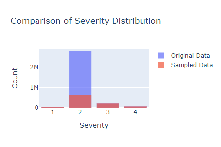

# US Traffic Accidents Analysis
## 1. Project Overview
With this project we explore data about traffic accidents in the US to uncover the factors associated with different level of severity of an accident. We also build a machine learning model to predict the severity of an accident. Insights from the data could be used to set up effective measures to prevent and/or swiftly respond to traffic accidents.

## 2. Data Processing
### 2.1. Data Overview
The US Traffic Accident dataset from [Kaggle](https://www.kaggle.com/datasets/sobhanmoosavi/us-accidents) provides comprehensive information on traffic accidents across the United States from 2016 to 2023. It contains 7,728,394 rows and 46 columns, each representing a different attribute of the accidents. Here's a brief overview of some of the key columns:

* `ID`: Unique identifier for each accident.
* `Source`: Source of the accident report (e.g., 911 call, news).
* `Severity`: Accident severity rating (on a scale from 1 to 4). 1 indicates the least impact on traffic (i.e., short delay as a result of the accident) and 4 indicates a significant impact on traffic (i.e., long delay).
* `Start_Time`: Start time of the accident.
* `End_Time`: Time when the impact of accident on traffic flow was dismissed.
* `Start_Lat/Start_Lng`: Latitude and longitude where the accident started.
* `End_Lat/End_Lng`: Latitude and longitude where the accident ended (many missing values).
* `Distance(mi)`: The length of the road extent affected by the accident.
* `Description`: Brief description of the accident.
* `Street`, `City`, `County`, `State`, `Zipcode`: Location details of the accident.
* `Country`: Country where the accident occurred (all should be the USA).
* `Timezone`: Timezone of the accident location.
* `Airport_Code`: Nearest airport to the accident location.
* `Weather_Timestamp`: Time when weather data was recorded.
* `Temperature(F)`, `Wind_Chill(F)`, `Humidity(%)`, `Pressure(in)`, `Visibility(mi)`, `Wind_Direction`, `Wind_Speed(mph)`, `Precipitation(in)`, `Weather_Condition`: Various weather-related attributes.
* `Amenity`, `Bump`, `Crossing`, `Give_Way`, `Junction`, `No_Exit`, `Railway`, `Roundabout`, `Station`, `Stop`, `Traffic_Calming`, `Traffic_Signal`, `Turning_Loop`: Boolean indicators for the presence of specific road features.
* `Sunrise_Sunset`, `Civil_Twilight`, `Nautical_Twilight`, `Astronomical_Twilight`: Time of day indicators related to the position of the sun.

As we want to predict accident severity, some columns may be redundant or not useful for our predictive modeling. These would be `ID`, `Description`, `Source`, `End_Lat/End_Lng`, `Country`, and `Airport_Code`.

### 2.2. Preprocessing Steps
1. Drop duplicates values as well as redundant or irrelevant columns
2. Handle missing values by (i) removing rows when the percentage of missing values is very small (<2%) or (ii) filling missing values by imputation.
3. Fixing inconsistencies with numerical variables by removing outliers and impossible values. For instance, temperatures of 203 F are quite unrealistic.
4. Feature extraction: extracted more data from existing columns. For instance, we can extract `Is_Highway` from the street name or `Hour`, `Day`, `Month`, etc. from `Start_Time`. We also create new feature by combining existing ones (ex. `Duration(min)` from `Start_Time` and `End_time`).

#### Down-sampling
The dataset contains over 7 millions rows and has a size of 1.5Go (or more). In this analysis and beyond, we are focusing solely on the years 2021 and 2022 for our analysis to ensure that our insights and predictive models are based on the most recent and relevant data available.
* *Recent and Relevant Data:* The years 2021 and 2022 would be more relevant to leverage the most current insights into what influences impacting accident severity.
* *Higher Data Volume:* Despite comprising a smaller portion of the dataset (43%), data from the years 2021 and 2022 offer a substantial amount of recorded accidents, ensuring robust analysis and modeling.
* *Accuracy in Predictions:* By analyzing recent years, we aim to produce predictive models that accurately reflect present-day accident trends and conditions, enhancing the reliability of our forecasts.
* *Resource Optimization:* Prioritizing these years optimizes our resources (less data to process) by concentrating efforts on data that is more likely to yield actionable insights.

  

We understand that nearly all the reported accidents in the US were of severity 2. However, for the purpose of analysis and modeling, we may downsample to make the dataset balanced as we are more interested in studying factors for accident severity.

  

## 3. Exploratory Data Analysis
### 3.1. Univariate Analysis
* *Time of Day:* Accidents peak during morning and evening rush hours, with fewer incidents during early morning hours (12-5 AM), correlating with traffic density patterns. In addition, weekdays, especially Fridays, show higher accident frequencies, possibly due to increased traffic volume compared to weekends.
* *Weather Conditions:* Accidents are frequent in clear weather, likely due to higher traffic volumes under normal conditions. Higher humidity correlates with more accidents, possibly due to reduced visibility and wet road conditions. Overall, accidents are most frequent in clear and cloudy weather, indicating that adverse weather might not be the primary factor influencing accidents.
* Most boolean variables (`Amenity`, `Bump`, `Give_Way`, etc.) are predominantly False (>95%), indicating these features are not present in the majority of accidents but their absence could impact severity.
* *High-Risk Areas:* Accidents are notably concentrated in areas with crossings, junctions, and traffic signals, suggesting higher risk in these locations.
* *Night-time Accidents:* A significant proportion (31%) of accidents occur at night, highlighting challenges with low-light conditions.
* *Highway Accidents:* While most accidents occur on local roads (72%), highways still account for a notable 28% of accidents.
* *Location Factors:* Cities and states with higher population densities and extensive road networks tend to report more accidents, likely due to increased traffic volume and diverse driving conditions.

  

### 3.2. Analysis with respect to Accident Severity
* *Spatial Distribution:* More severe accidents tend to cluster in densely populated cities and highways, particularly in the eastern US.
* *Temporal Factors:* Accidents are fairly uniform throughout the month, with slight variations towards month-end. Severity 2 and 3 accidents peak during rush hours, while Severity 4 accidents show a more uniform distribution throughout the day. Fridays show higher accident rates across all severities, likely due to increased traffic.
* *Distance Affected:* Severity increases slightly with distance, indicating more severe accidents may affect longer road segments.
* *Weather Condition:* Adverse weather significantly increases Severity 2 accidents, especially precipitation, snowstorms, and visibility issues. Higher severity accidents occur across a range of temperatures, but often cooler conditions. Humidity and pressure seem not play much of a role in comparison. Higher wind speeds correlate with more severe accidents. and visibility is slightly lower for more severe accidents.
* *Duration of the Accident:* Increases with severity, indicating longer incident response times for more severe accidents.
* *Seasonal Patterns:* Severity 3 accidents decrease in winter, while Severity 4 accidents peak in December and severity 1 peaks in summer months.
* *State:* There is a greater variability of severity 2, 3 and 4 accidents across states, with some states showing higher proportions.

### 3.3. Correlation Analysis
In our analysis, we employed several statistical methods to measure the relationships between various types of variables and the target variable, `Severity` of accidents. 
* For numerical and time-related variables such as `Distance`, `Temperature`, and `Hour`, we utilized Spearman's Rank Correlation Coefficient. 
* For categorical variables like `State` and `Weather_Category`, we employed the Chi-Square Test to assess the independence between different categories and the levels of `Severity`. 
* Boolean variables such as `Amenity` and `Crossing` were also analyzed using Point-Biserial Correlation.
* Ordinal variables such as `Month` and `Day_of_Week` were evaluated using Spearman's Rank Correlation Coefficient to understand their monotonic relationships with `Severity` levels.

  

Some variables have a relatively strong relationship with the severity of the accident. We could use them as features in a predictive model.
* `Distance(mi)`: Strong negative correlation (-0.447) suggests it's a significant predictor.
* `Duration(min)`: Strong negative correlation (-0.289) indicates it should be included.
* `State`: Moderate positive correlation (0.237) implies state-specific factors affecting severity should be accounted for.
* `Weather_Category`: Slight positive correlation (0.044) and domain knowledge suggests considering weather conditions.
* `Is_Highway`: Moderate positive correlation (0.251) indicates the importance of distinguishing accidents on highways.
* `Crossing`: Moderate negative correlation (-0.125) highlights the impact of accidents involving crossings.
* `Hour`: Hourly patterns can directly relate to traffic conditions, commuter behavior, and visibility, which are critical factors influencing accident severity.

## 4. Predictive Models
